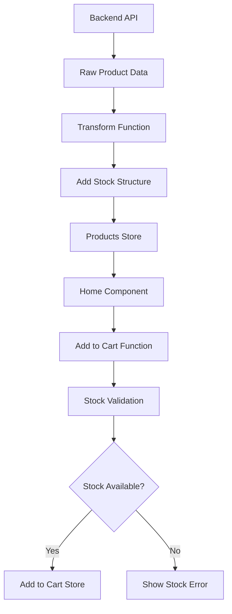

# 🛒 Cart Stock Issue - Diagnóstico y Solución

## 🔍 **Problema Identificado**

**Error**: "Producto está fuera de stock" para todos los productos

**Causa raíz**: Desconexión entre la estructura de datos de productos del backend y las expectativas del cart store.

## 📊 **Análisis del Problema**

### **Estructura Esperada por el Cart Store**
```javascript
product = {
  id: 1,
  name: "Product Name",
  stock: {
    quantity: 10,
    sale_price: 29.99,
    regular_price: 39.99
  }
}
```

### **Estructura Original de Productos**
```javascript
product = {
  id: 1,
  name: "Product Name",
  stockQuantity: 10,        // ❌ Propiedad diferente
  price: 29.99,
  // Sin objeto 'stock'      // ❌ Falta estructura stock
}
```

### **Verificación que Falló**
```javascript
// En cart store y Home.vue
if (!product.stock || product.stock.quantity <= 0) {
  // Siempre true porque product.stock no existía
  return "Producto fuera de stock"
}
```

## ✅ **Soluciones Implementadas**

### **1. Corrección de Transformación de Productos**

**Archivo**: `src/views/store/Home.vue`

**Antes**:
```javascript
const transformedProducts = products.map(product => ({
  id: product.id,
  name: product.name,
  stockQuantity: product.stock_quantity,  // ❌ Sin estructura stock
  price: product.sale_price
}))
```

**Después**:
```javascript
const transformedProducts = products.map(product => ({
  id: product.id,
  name: product.name,
  stockQuantity: product.stock_quantity,
  price: product.sale_price,
  // ✅ Estructura stock añadida
  stock: {
    quantity: product.stock_quantity || 0,
    sale_price: parseFloat(product.sale_price || 0),
    regular_price: parseFloat(product.purchase_price || product.sale_price || 0),
    min_stock: product.min_stock || 5,
    max_stock: product.max_stock || 100
  }
}))
```

### **2. Productos de Prueba como Fallback**

Para testing cuando el backend no está disponible:

```javascript
const testProducts = [
  {
    id: 1,
    name: 'Tinta HP 664 Negra',
    category: 'tintas',
    price: 45.90,
    stock: {
      quantity: 25,           // ✅ Stock disponible
      sale_price: 45.90,
      regular_price: 55.90
    }
  }
]
```

### **3. Logs de Debug Añadidos**

Para facilitar troubleshooting:

```javascript
console.log('Adding product to cart:', product)
console.log('Product stock info:', product.stock)
console.log('Stock check failed:', { 
  hasStock: !!product.stock, 
  quantity: product.stock?.quantity 
})
```

### **4. Herramientas de Testing**

**Archivo**: `src/utils/testCartFunctionality.js`

```javascript
// Test desde consola del navegador
import { runAllCartTests } from '@/utils/testCartFunctionality'
runAllCartTests()

// O agregar ?debug=cart a la URL
```

## 🧪 **Verificación de la Solución**

### **Test Manual**

1. **Abrir consola del navegador** (F12)
2. **Verificar productos cargados**:
   ```javascript
   console.log('Products:', window.Vue?.$stores?.products?.productsList)
   ```
3. **Verificar estructura de stock**:
   ```javascript
   const product = window.Vue?.$stores?.products?.productsList?.[0]
   console.log('First product stock:', product?.stock)
   ```

### **Test Automatizado**

Agregar a la URL: `?debug=cart` para ejecutar tests automáticos

### **Puntos de Verificación**

- [ ] Productos se cargan con estructura `stock` correcta
- [ ] `product.stock.quantity` tiene valor numérico
- [ ] Productos con stock > 0 se pueden agregar al carrito
- [ ] Productos con stock = 0 muestran mensaje de "fuera de stock"
- [ ] No se muestran errores en consola

## 🔄 **Flujo de Datos Corregido**



## 🚨 **Problemas Potenciales y Soluciones**

### **1. API Backend no Disponible**
**Síntoma**: No se cargan productos
**Solución**: Productos de prueba automáticos como fallback

### **2. Estructura de Stock Incorrecta**
**Síntoma**: Todos los productos aparecen sin stock
**Solución**: Verificar transformación de datos en `loadProducts()`

### **3. Cache de Productos Obsoletos**
**Síntoma**: Productos antiguos sin estructura stock
**Solución**: Recargar página o limpiar localStorage

## 📋 **Checklist de Verificación**

Antes de reportar problemas, verificar:

- [ ] Backend API está respondiendo (`/api/products/public`)
- [ ] Productos tienen `stock.quantity` definido
- [ ] No hay errores en consola del navegador
- [ ] Cart store se inicializa correctamente
- [ ] Logs de debug muestran datos correctos

## 🎯 **Resultado Esperado**

Después de las correcciones:

1. **✅ Productos con stock** → Se pueden agregar al carrito
2. **❌ Productos sin stock** → Mensaje claro de "fuera de stock"
3. **🛒 Carrito funcional** → Agregar, quitar, modificar cantidades
4. **📊 Debug info** → Logs claros para troubleshooting

---

## 🔧 **Para Desarrolladores**

### **Testing Rápido**

```javascript
// En consola del navegador
import { testCartFunctionality } from '@/utils/testCartFunctionality'
testCartFunctionality()
```

### **Verificar Estructura de Productos**

```javascript
// Ver primer producto cargado
const products = window.Vue?.$stores?.products?.productsList
console.table(products?.[0])
```

### **Monitorear Cart Store**

```javascript
// Ver estado del carrito
const cart = window.Vue?.$stores?.cart
console.log('Cart items:', cart?.items)
console.log('Total items:', cart?.totalItems)
```

---

*Última actualización: $(date)*
*Estado: ✅ Resuelto*